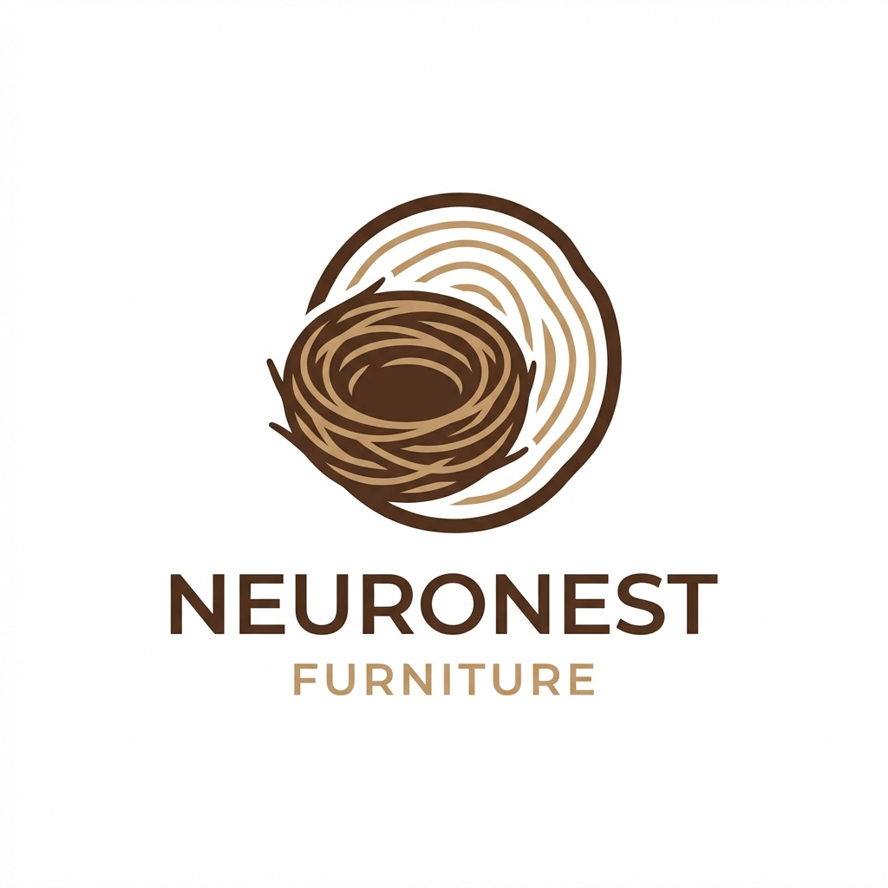

<p align="center">
  
</p>

<h1 align="center">🪵 NeuroNest Furniture</h1>

<p align="center">
  <strong>Website Thương Mại Điện Tử Đồ Gỗ Nội Thất Cao Cấp</strong>
</p>

<p align="center">
  <a href="#tính-năng">Tính năng</a> •
  <a href="#công-nghệ">Công nghệ</a> •
  <a href="#cài-đặt">Cài đặt</a> •
  <a href="#danh-mục-sản-phẩm">Sản phẩm</a>
</p>

---

## 📖 Giới thiệu

**NeuroNest Furniture** là nền tảng thương mại điện tử chuyên cung cấp các sản phẩm nội thất gỗ cao cấp. Từ bàn ghế, giường tủ đến các vật dụng trang trí nội thất cho gia đình và văn phòng - tất cả đều được chế tác từ gỗ tự nhiên với thiết kế hiện đại, sang trọng.

## ✨ Tính năng

| Tính năng | Mô tả |
|-----------|-------|
| 🛒 **Giỏ hàng thông minh** | Thêm, xóa và quản lý sản phẩm dễ dàng |
| 🔍 **Tìm kiếm & Lọc** | Lọc theo danh mục, giá, màu sắc, kích thước |
| 💳 **Thanh toán an toàn** | Hỗ trợ nhiều phương thức thanh toán |
| 📱 **Responsive Design** | Tương thích mọi thiết bị |
| 🌐 **Đa ngôn ngữ** | Hỗ trợ Tiếng Việt |
| ❤️ **Danh sách yêu thích** | Lưu sản phẩm yêu thích |
| 👤 **Quản lý tài khoản** | Đăng nhập, đăng ký, quản lý đơn hàng |
| 🖼️ **Xem nhanh sản phẩm** | Quick view modal với đầy đủ thông tin |

## 🛠️ Công nghệ

| Công nghệ | Mô tả |
|-----------|-------|
| **Next.js 14** | React Framework với App Router |
| **TypeScript** | Type-safe JavaScript |
| **Tailwind CSS** | Utility-first CSS Framework |
| **Redux Toolkit** | State Management |
| **Swiper** | Carousel & Slider |

## 📂 Cấu trúc thư mục

```
src/
├── app/                 # Next.js App Router
├── components/          # React Components
│   ├── Home/           # Trang chủ
│   ├── Shop/           # Trang cửa hàng
│   ├── Cart/           # Giỏ hàng
│   ├── Checkout/       # Thanh toán
│   └── Common/         # Components dùng chung
├── hooks/              # Custom Hooks
├── lang/               # Đa ngôn ngữ
├── redux/              # Redux Store & Slices
├── types/              # TypeScript Types
└── utils/              # Utility Functions
```

## 🚀 Cài đặt

### Yêu cầu
- Node.js 18+ 
- npm hoặc yarn

### Các bước thực hiện

```bash
# Clone repository
git clone https://github.com/Twitchhh3105/webdogo.git

# Di chuyển vào thư mục dự án
cd webdogo

# Cài đặt dependencies
npm install

# Chạy development server
npm run dev
```

Mở [http://localhost:3000](http://localhost:3000) để xem kết quả.

## 📦 Danh mục sản phẩm

- 🛋️ **Sofa** - Sofa da, sofa vải, sofa góc
- 🪑 **Ghế** - Ghế ăn, ghế làm việc, ghế thư giãn
- 🍽️ **Bàn** - Bàn ăn, bàn làm việc, bàn trà
- 🛏️ **Giường** - Giường đơn, giường đôi, giường tầng
- 🗄️ **Tủ** - Tủ quần áo, tủ giày, tủ sách

## 📄 Scripts

```bash
npm run dev      # Chạy development server
npm run build    # Build production
npm run start    # Chạy production server
npm run lint     # Kiểm tra lỗi code
```

## 👥 Đội ngũ phát triển

Dự án được phát triển bởi nhóm sinh viên **FPT University**.

## 📝 License

Dự án này được phát triển cho mục đích học tập và nghiên cứu.

---

<p align="center">
  ⭐ Nếu bạn thấy dự án hữu ích, hãy cho chúng tôi một star trên GitHub!
</p>

<p align="center">
  Made with ❤️ by NeuroNest Team
</p>
